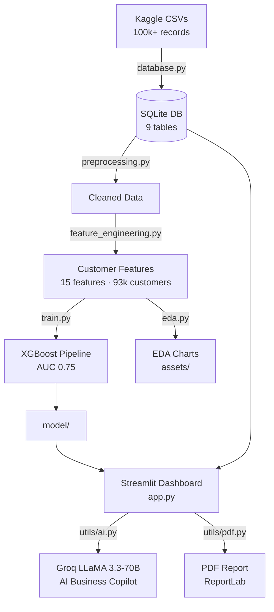

# AI-Powered Product Analytics Dashboard

> A production-quality, end-to-end data analytics platform built on the
> [Olist Brazilian E-Commerce dataset](https://www.kaggle.com/datasets/olistbr/brazilian-ecommerce).
> Combines SQL data engineering, XGBoost churn prediction, SHAP explainability,
> an interactive Streamlit dashboard, and an AI Business Copilot powered by Groq LLaMA 3.3.

[](https://python.org)
[](https://streamlit.io)
[](https://xgboost.ai)
[](https://sqlite.org)
[](https://plotly.com)
[](LICENSE)

[Live Demo](https://olist-analytics.streamlit.app/) | [GitHub Repository](https://github.com/raghavPahwa27/Product-Analytics-Dashboard)

---

## 🖥️ Dashboard Showcase

### 🏠 Executive Dashboard


### 🤖 Churn Prediction & Explainability (SHAP)


### ✨ AI Copilot Insights


### 📈 Sales Analytics


---

## ## Features

✓ **SQL-based analytics**: Automated processing of Olist e-commerce database with SQLite.
✓ **Customer churn prediction**: XGBoost model with leak-free features achieving 0.750 ROC AUC.
✓ **SHAP explainability**: Individualized prediction explanations (why this customer is predicted to churn).
✓ **Interactive Streamlit dashboard**: Beautiful multi-page app with dynamic filtering.
✓ **AI Insights Copilot**: Grounded business summaries and recommendations powered by Groq LLaMA 3.3.
✓ **Executive PDF reports**: Downloadable, professional A4 summaries generated via ReportLab.
✓ **Plotly visualizations**: High-fidelity interactive area, bar, scatter, heatmap, and indicator charts.
✓ **Global filtering**: Seamless sidebar filters for state, category, date, and payment type.

---

## Project Overview

This project is a complete analytics pipeline from raw CSV to interactive AI-powered dashboard:

| Layer | Technology |
|---|---|
| Data Storage | SQLite (9 tables, 100k+ records) |
| Data Engineering | Python + Pandas + SQL |
| Feature Engineering | 15 behavioural features per customer |
| Machine Learning | Logistic Regression, Random Forest, XGBoost |
| Explainability | SHAP TreeExplainer |
| Dashboard | Streamlit + Plotly |
| AI Copilot | Groq LLaMA 3.3-70B (OpenAI-compatible) |
| PDF Reports | ReportLab |

---

## Architecture



---

## Database Schema

```
customers          customer_id, customer_unique_id, state, city
orders             order_id, customer_id, status, timestamps
order_items        order_id, product_id, price, freight_value
products           product_id, category_name, dimensions
payments           order_id, payment_type, payment_sequential, value
reviews            review_id, order_id, score, created_at
sellers            seller_id, state, city
geolocation        zip, lat, lng, city, state
product_category_translation  portuguese ↔ english
```

---

## Machine Learning Pipeline

### Feature Engineering
15 behavioural features per unique customer:

| Feature | Description |
|---|---|
| `num_orders` | Total orders placed |
| `total_spend` | Cumulative spend (R$) |
| `avg_order_value` | Mean spend per order |
| `avg_review_score` | Mean review score |
| `avg_delivery_days` | Mean actual delivery time |
| `pct_delayed` | Fraction of delayed orders |
| `avg_freight_ratio` | Freight as % of item value |
| `customer_lifetime_days` | Days between first and last order |
| `state` | Brazilian state (categorical) |
| `preferred_payment_method` | Most frequent payment type |
| … | + 5 more |

### Churn Label
A customer is labelled **churned** if they have not placed an order within **180 days** of their most recent purchase.

### Model Comparison

| Model | ROC AUC | F1 |
|---|---|---|
| **XGBoost** | **0.750** | **0.717** |
| Random Forest | 0.675 | 0.672 |
| Logistic Regression | 0.631 | 0.604 |

### Data Leakage Prevention
`days_since_last_purchase`, `days_since_first_purchase`, and `purchase_frequency`
were excluded because for this dataset 93% of customers have only one order —
these features are almost perfectly correlated with the churn label,
producing artificially inflated AUC scores that would not generalise.

---

## Installation

```bash
# 1. Clone
git clone https://github.com/raghavPahwa27/Product-Analytics-Dashboard.git
cd Product-Analytics-Dashboard

# 2. Install dependencies
pip install -r requirements.txt

# 3. Configure Groq API key (optional — AI Copilot only)
cp .env.example .env
# Edit .env: GROQ_API_KEY=your_key_here

# 4. Download dataset and build database
python database.py          # downloads from Kaggle → builds SQLite

# 5. Run the pipeline
python preprocessing.py     # clean & validate raw data
python feature_engineering.py  # build customer_features.parquet
python train.py             # train XGBoost, save model + artefacts

# 6. Launch dashboard
streamlit run app.py
```

---

## Usage

```bash
# Start the dashboard
streamlit run app.py
# → http://localhost:8501

# Retrain the model
python train.py

# Generate a sample churn prediction
python predict.py
```

### Setting the Groq API Key

**Local development:**
```bash
export GROQ_API_KEY=your_key_here
streamlit run app.py
```

**Streamlit Cloud:**
Add in the app settings → Secrets:
```toml
GROQ_API_KEY = "your_key_here"
```

---

## Folder Structure

```
Product-Analytics-Dashboard/
├── app.py                    # Dashboard router (~70 lines)
├── pages/
│   ├── executive.py          # Executive Dashboard
│   ├── sales.py              # Sales Analytics
│   ├── customer.py           # Customer Analytics
│   ├── product.py            # Product Analytics
│   ├── regional.py           # Regional Analytics
│   ├── churn.py              # Churn Prediction
│   └── copilot.py            # AI Business Copilot
├── utils/
│   ├── data.py               # Cached data loaders
│   ├── ui.py                 # CSS, KPI cards, chart helpers
│   ├── ai.py                 # Groq client + prompt builders
│   └── pdf.py                # ReportLab PDF generator
├── sql/                      # SQL query files
├── model/
│   ├── churn_model.pkl       # Trained XGBoost pipeline (gitignored)
│   ├── model_metrics.json    # AUC, F1, Precision, Recall
│   ├── feature_importance.csv
│   └── classification_report.txt
├── assets/                   # Generated SHAP plots & page screenshots
├── data/                     # Local data (gitignored)
├── database.py               # Kaggle download + SQLite import
├── preprocessing.py          # Data cleaning
├── feature_engineering.py    # Feature computation
├── eda.py                    # Exploratory analysis
├── train.py                  # ML training pipeline
├── predict.py                # Sample inference
├── requirements.txt
├── .env.example
├── LICENSE
└── CONTRIBUTING.md
```

---

## Deployment (Streamlit Community Cloud)

1. Push this repository to GitHub (ensure `data/` and `model/*.pkl` are gitignored)
2. Go to [share.streamlit.io](https://share.streamlit.io) → **New app**
3. Select repository, branch `main`, entry file `app.py`
4. Add secrets under **Advanced settings → Secrets**:
   ```toml
   GROQ_API_KEY = "your_groq_api_key"
   ```
5. Add a **requirements.txt** setup command or use the file as-is
6. **Important**: The SQLite database and parquet file are not committed.
   Add a `setup.py` or document that first-run users must run `database.py`,
   `feature_engineering.py`, and `train.py` locally and upload artefacts,
   or use a cloud storage bucket for the data files.

---

## Dataset

[Olist Brazilian E-Commerce Public Dataset](https://www.kaggle.com/datasets/olistbr/brazilian-ecommerce)
by Olist, published on Kaggle under CC BY-NC-SA 4.0.

---

## License

[MIT](LICENSE) — © 2024 Raghav Pahwa
