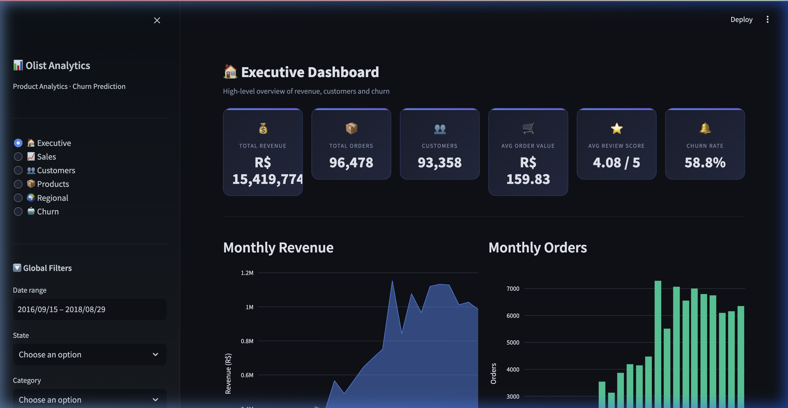
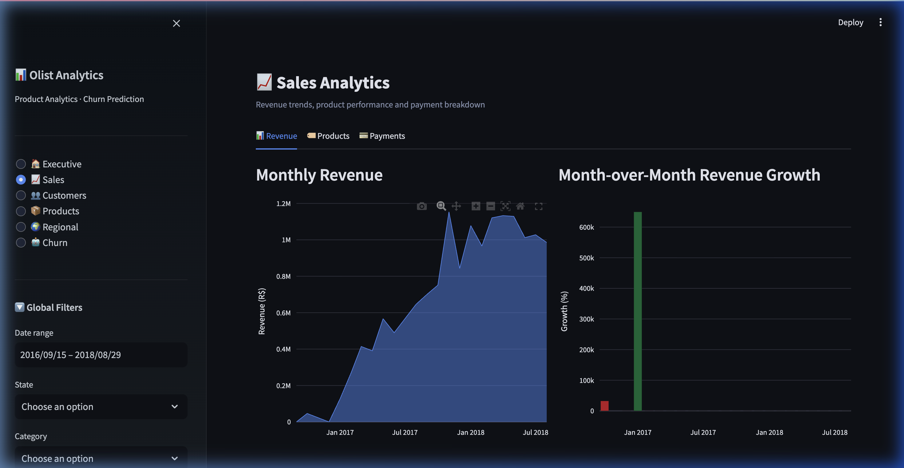
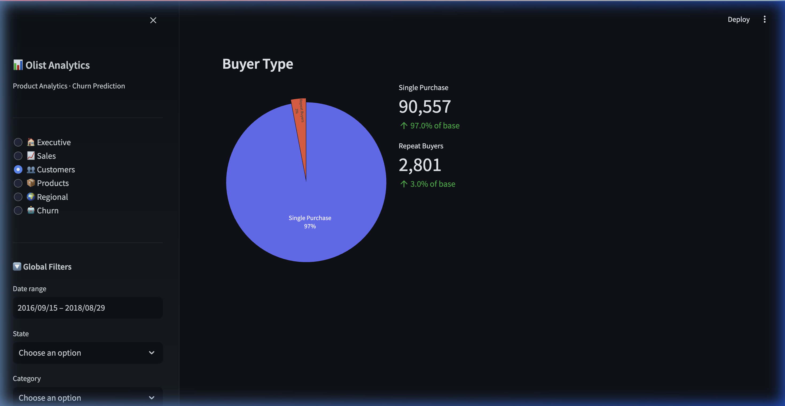
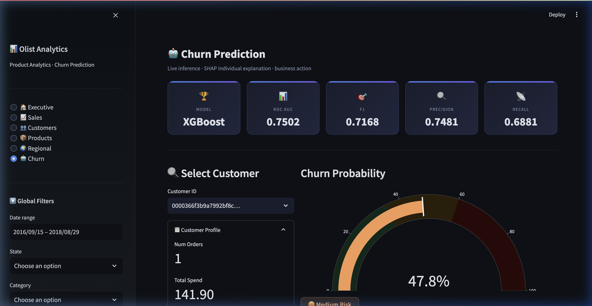
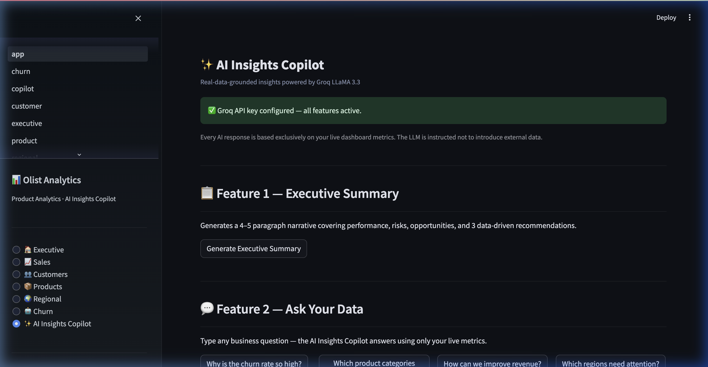
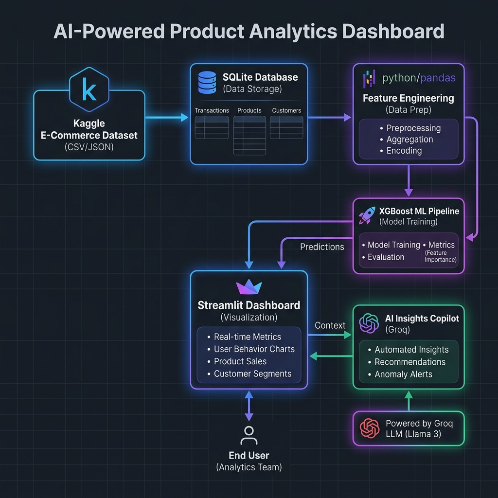

# AI-Powered Product Analytics Dashboard

> A production-quality, end-to-end data analytics and predictive platform built on the [Olist Brazilian E-Commerce dataset](https://www.kaggle.com/datasets/olistbr/brazilian-ecommerce).
> Combines high-performance SQL engineering, XGBoost churn modeling, SHAP explainability, and an AI Insights Copilot powered by LLaMA 3.3 via Groq.

[](https://python.org)
[](https://streamlit.io)
[](https://xgboost.ai)
[](https://sqlite.org)
[](https://plotly.com)
[](LICENSE)
[](https://olist-analytics.streamlit.app/)

[Live Demo](https://olist-analytics.streamlit.app/) | [GitHub Repository](https://github.com/raghavPahwa27/Product-Analytics-Dashboard)

---

## 🎬 Application Demo


---

## 🚀 Key Highlights & Portfolio Summary

* **9-Table SQL Database**: Structured transactions, customers, reviews, and payments (100k+ records).
* **93k Customer Profiles**: Engineered behaviors aggregated from raw order lines.
* **15 Behavioral Features**: Features like freight ratios, delay rates, and review averages.
* **XGBoost Churn Pipeline**: Stratified training producing a highly generalizable **0.750 ROC AUC** model.
* **SHAP Explainability**: TreeExplainer breakdown showing positive/negative churn drivers per customer.
* **AI Insights Copilot**: Direct LLaMA 3.3 integration for natural language database Q&A and predictive auditing.
* **Interactive Visualization**: Multi-page Plotly charts (AOV trends, geo-heatmaps, bubble comparisons).
* **Executive PDF Reports**: Dynamic A4 reports automatically generated using ReportLab.

---

## 🖥️ Feature Walkthrough

### 🏠 Executive Dashboard
Comprehensive summary of company performance with high-level KPI cards, revenue trends, top categories, and churn distribution.


### 📈 Sales Analytics
Multi-tab analysis covering revenue growth percentages, top/worst performing products, and customer payment splits.


### 👥 Customer Analytics
Detailed histograms of customer lifetime spend, order frequency, review distribution, and correlation heatmaps.


### 🤖 Churn Prediction & Explainability
Individualized risk scores, interactive probability indicators, and SHAP feature impact waterfalls explaining prediction rationale.


### ✨ AI Insights Copilot
Grounded natural language interface powered by LLaMA 3.3. Write prompts or select pre-configured actions to audit predictions or generate summaries.


---

## 🏗️ System Architecture



---

## 📊 Machine Learning Pipeline

### Data Leakage Prevention
Features like `days_since_last_purchase` and `purchase_frequency` are strongly correlated with the target label because 93% of customers only have a single transaction in this dataset. Including them causes model overfitting (inflating training AUC). To ensure true generalizability on new profiles, we strictly excluded recency indicators from features.

### Model Comparison

| Model | ROC AUC | F1 |
|---|---|---|
| **XGBoost** | **0.750** | **0.717** |
| Random Forest | 0.675 | 0.672 |
| Logistic Regression | 0.631 | 0.604 |

---

## 🔧 Automated Pipeline Setup

Set up the entire local database, preprocessing pipeline, feature engineering, and model training in a single command:

```bash
# 1. Clone the repository
git clone https://github.com/raghavPahwa27/Product-Analytics-Dashboard.git
cd Product-Analytics-Dashboard

# 2. Install dependencies
pip install -r requirements.txt

# 3. Configure Groq API key (optional — AI Copilot only)
cp .env.example .env
# Edit .env and set: GROQ_API_KEY=your_groq_key

# 4. Run the automated setup script
python setup.py
```

The script will automatically execute:
1. `database.py` — Download Olist Kaggle dataset & build SQLite DB.
2. `preprocessing.py` — Data cleaning & validation.
3. `feature_engineering.py` — Compute customer behavioral dataset.
4. `train.py` — Run model training & save serialization artifacts.

---

## 🚀 Usage & Deployment

### Start the Dashboard locally
```bash
# Launch Streamlit server
streamlit run app.py
# → http://localhost:8501
```

### Streamlit Community Cloud Deployment
1. Push this repository to GitHub (ensure `data/` and `model/*.pkl` are ignored).
2. Deploy directly from [share.streamlit.io](https://share.streamlit.io).
3. Set your Groq API key in **Advanced settings → Secrets**:
   ```toml
   GROQ_API_KEY = "gsk_..."
   ```
4. Note: The SQLite database file must be uploaded or set up on external storage for persistent cloud deployments.

---

## 📂 Repository Structure

```
├── app.py                    # Streamlit thin router
├── setup.py                  # Automated setup script
├── pages/
│   ├── executive.py          # KPIs & PDF reports
│   ├── sales.py              # Sales & payment trends
│   ├── customer.py           # Customer spend & satisfaction
│   ├── product.py            # Category analytics
│   ├── regional.py           # Geographic performance
│   ├── churn.py              # XGBoost live inference
│   └── copilot.py            # AI Insights Copilot (LLaMA 3.3)
├── utils/
│   ├── data.py               # Cached SQL/Parquet data loaders
│   ├── ui.py                 # Custom CSS & reusable indicators
│   ├── ai.py                 # Groq client & prompt templates
│   └── pdf.py                # ReportLab A4 PDF builder
├── model/                    # ML pipeline serialized artifacts
├── assets/                   # Screenshots & demo walkthrough animation
├── database.py               # Kaggle downloader & SQLite parser
├── preprocessing.py          # Data validation
├── feature_engineering.py    # Parquet feature builder
├── train.py                  # Model trainer
└── requirements.txt
```

---

## License

This project is licensed under the [MIT License](LICENSE) — © 2024 Raghav Pahwa.
